# Analyse voor de wachttijden van attracties in Plopsaland

 Dit is een automatisch gegenereerd bestand, veranderingen zullen worden overschreven

 Dit bestand is gemaakt op 11/12/2022 om 11:12:50

 <h2> Attracties</h2> 

<h3> #LikeMe Coaster</h3>
Gemiddelde wachttijd: 2,42 minuten  Mediaan wachttijd: 0,0 minuten  Standaard deviatie: 2,51 minuten  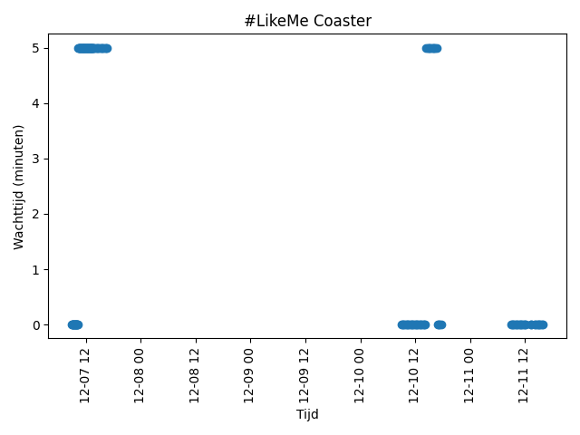
<h3> Amika</h3>
Gemiddelde wachttijd: 0,0 minuten  Mediaan wachttijd: 0,0 minuten  Standaard deviatie: 0,0 minuten  
<h3> Anubis The Ride</h3>
Gemiddelde wachttijd: 2,81 minuten  Mediaan wachttijd: 5,0 minuten  Standaard deviatie: 2,49 minuten  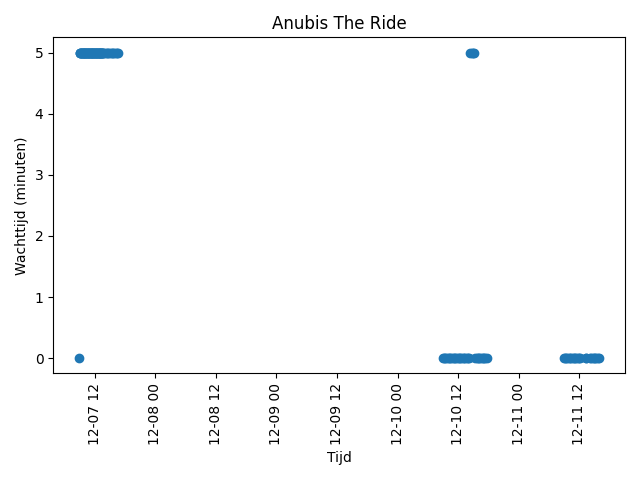
<h3> Balloon Race</h3>
Gemiddelde wachttijd: 4,65 minuten  Mediaan wachttijd: 5,0 minuten  Standaard deviatie: 1,27 minuten  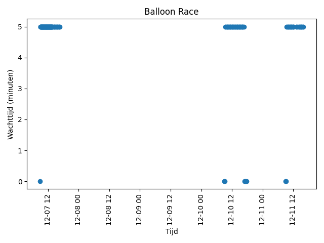
<h3> Big's Garden</h3>
Gemiddelde wachttijd: 0,0 minuten  Mediaan wachttijd: 0,0 minuten  Standaard deviatie: 0,0 minuten  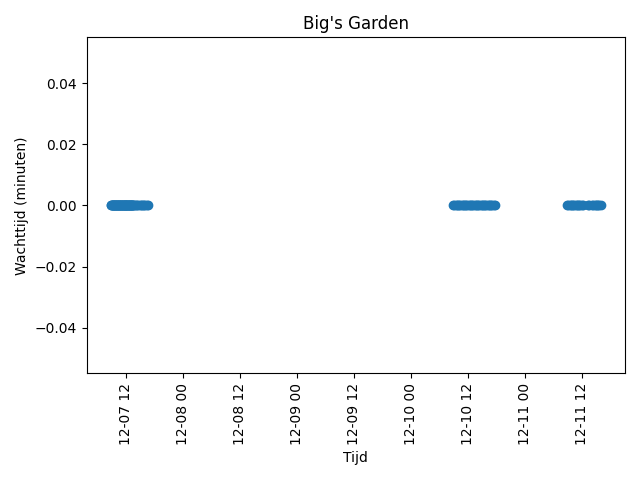
<h3> Bumba's Playground</h3>
Gemiddelde wachttijd: 0,0 minuten  Mediaan wachttijd: 0,0 minuten  Standaard deviatie: 0,0 minuten  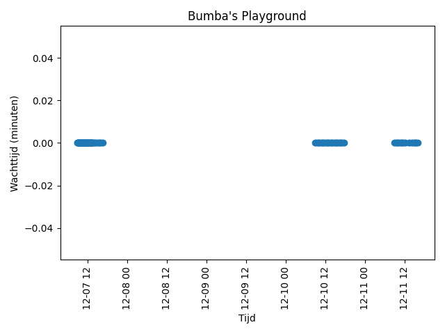
<h3> DinoSplash</h3>
Gemiddelde wachttijd: 2,12 minuten  Mediaan wachttijd: 0,0 minuten  Standaard deviatie: 2,48 minuten  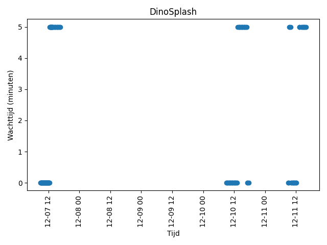
<h3> Heidi The Ride</h3>
Gemiddelde wachttijd: 3,69 minuten  Mediaan wachttijd: 5,0 minuten  Standaard deviatie: 2,21 minuten  
<h3> K3 Roller Skater</h3>
Gemiddelde wachttijd: 3,31 minuten  Mediaan wachttijd: 5,0 minuten  Standaard deviatie: 2,38 minuten  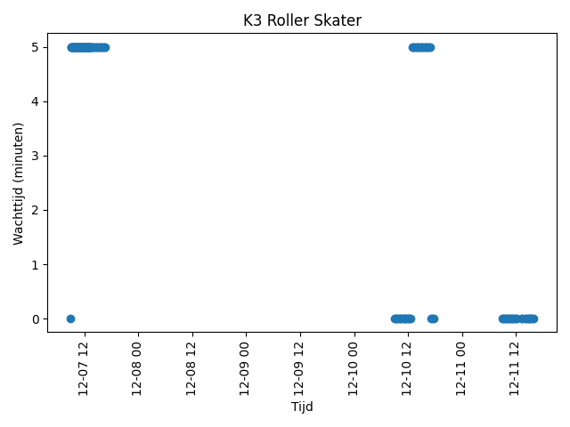
<h3> Kaatje zoekt Eendje</h3>
Gemiddelde wachttijd: 3,08 minuten  Mediaan wachttijd: 5,0 minuten  Standaard deviatie: 2,44 minuten  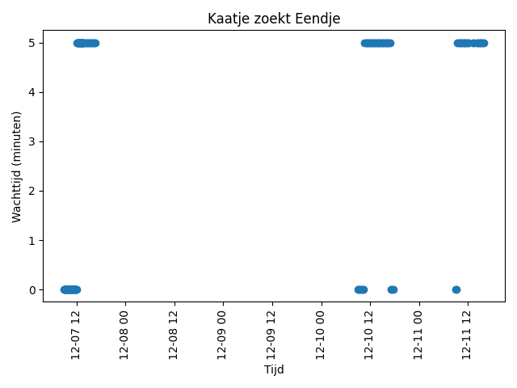
<h3> Mega Mindy Jet-ski</h3>
Gemiddelde wachttijd: 4,5 minuten  Mediaan wachttijd: 5,0 minuten  Standaard deviatie: 1,51 minuten  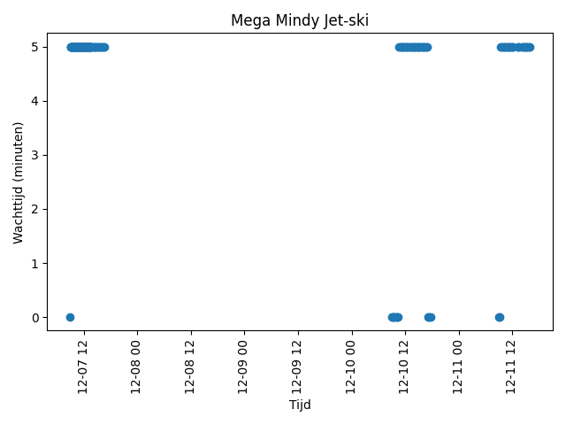
<h3> Nachtwacht-Flyer</h3>
Gemiddelde wachttijd: 0,0 minuten  Mediaan wachttijd: 0,0 minuten  Standaard deviatie: 0,0 minuten  
<h3> Plop's Garden</h3>
Gemiddelde wachttijd: 0,0 minuten  Mediaan wachttijd: 0,0 minuten  Standaard deviatie: 0,0 minuten  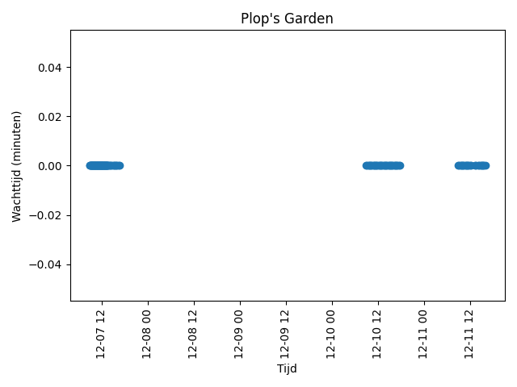
<h3> Plop's Woods</h3>
Gemiddelde wachttijd: 4,5 minuten  Mediaan wachttijd: 5,0 minuten  Standaard deviatie: 1,51 minuten  
<h3> Plopsa Express</h3>
Gemiddelde wachttijd: 7,15 minuten  Mediaan wachttijd: 10,0 minuten  Standaard deviatie: 3,35 minuten  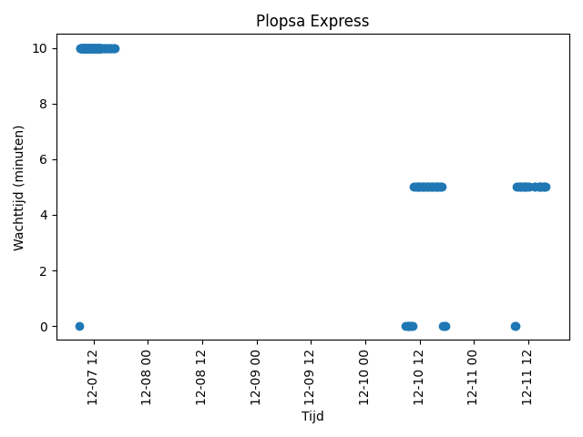
<h3> Safari</h3>
Gemiddelde wachttijd: 4,5 minuten  Mediaan wachttijd: 5,0 minuten  Standaard deviatie: 1,51 minuten  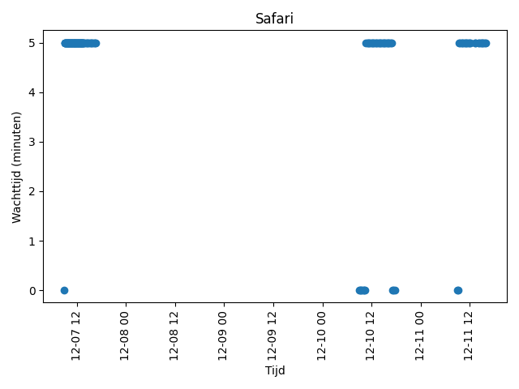
<h3> Storm At Sea</h3>
Gemiddelde wachttijd: 4,5 minuten  Mediaan wachttijd: 5,0 minuten  Standaard deviatie: 1,51 minuten  
<h3> SuperSplash</h3>
Gemiddelde wachttijd: 2,65 minuten  Mediaan wachttijd: 5,0 minuten  Standaard deviatie: 2,5 minuten  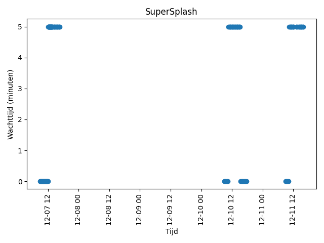
<h3> The Animal Carousel</h3>
Gemiddelde wachttijd: 4,23 minuten  Mediaan wachttijd: 5,0 minuten  Standaard deviatie: 1,81 minuten  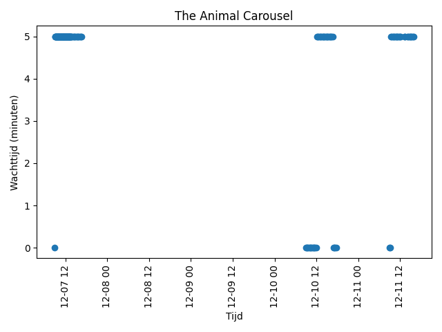
<h3> The Animal Farm</h3>
Gemiddelde wachttijd: 0,0 minuten  Mediaan wachttijd: 0,0 minuten  Standaard deviatie: 0,0 minuten  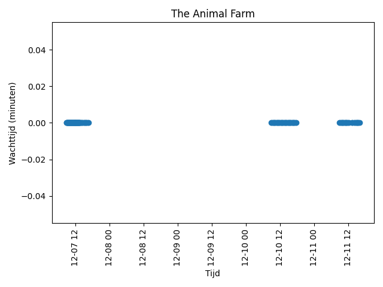
<h3> The Ball Bath</h3>
Gemiddelde wachttijd: 0,0 minuten  Mediaan wachttijd: 0,0 minuten  Standaard deviatie: 0,0 minuten  
<h3> The Big & Betsy Farm</h3>
Gemiddelde wachttijd: 0,0 minuten  Mediaan wachttijd: 0,0 minuten  Standaard deviatie: 0,0 minuten  
<h3> The Big Wave</h3>
Gemiddelde wachttijd: 4,19 minuten  Mediaan wachttijd: 5,0 minuten  Standaard deviatie: 1,85 minuten  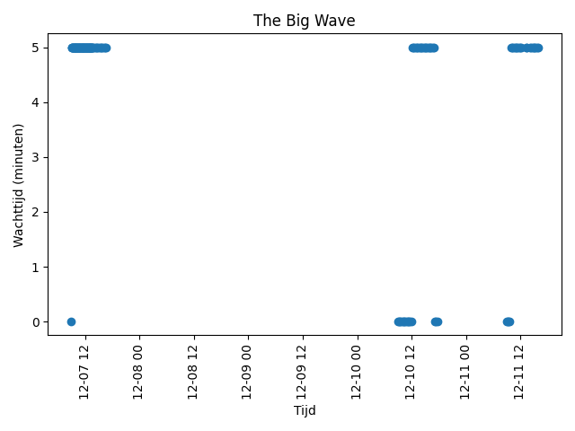
<h3> The Bucket</h3>
Gemiddelde wachttijd: 0,0 minuten  Mediaan wachttijd: 0,0 minuten  Standaard deviatie: 0,0 minuten  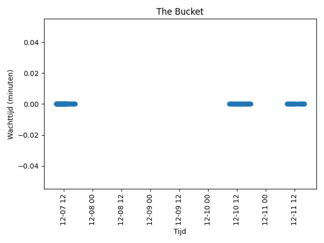
<h3> The Bumper Cars</h3>
Gemiddelde wachttijd: 4,5 minuten  Mediaan wachttijd: 5,0 minuten  Standaard deviatie: 1,51 minuten  
<h3> The Chute</h3>
Gemiddelde wachttijd: 0,0 minuten  Mediaan wachttijd: 0,0 minuten  Standaard deviatie: 0,0 minuten  
<h3> The Climbing Tree</h3>
Gemiddelde wachttijd: 0,0 minuten  Mediaan wachttijd: 0,0 minuten  Standaard deviatie: 0,0 minuten  
<h3> The Coffee Cups</h3>
Gemiddelde wachttijd: 4,69 minuten  Mediaan wachttijd: 5,0 minuten  Standaard deviatie: 1,21 minuten  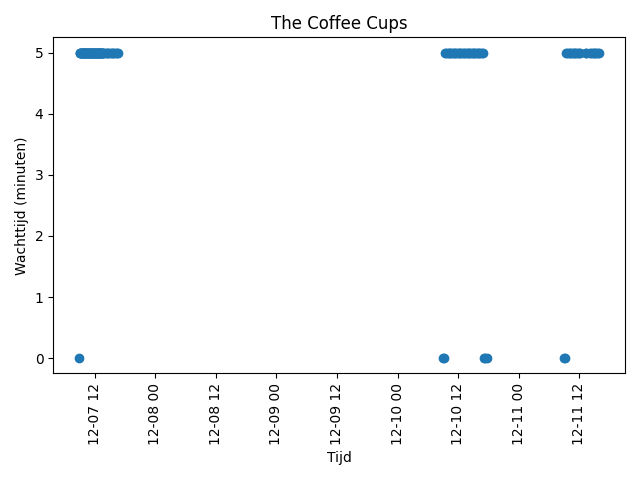
<h3> The Dancing Fountains</h3>
Gemiddelde wachttijd: 0,0 minuten  Mediaan wachttijd: 0,0 minuten  Standaard deviatie: 0,0 minuten  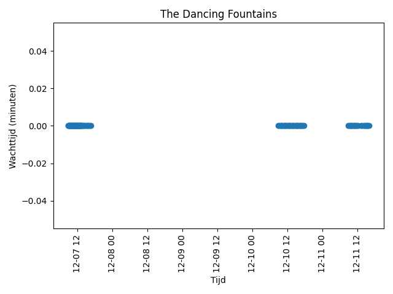
<h3> The Dragon</h3>
Gemiddelde wachttijd: 3,62 minuten  Mediaan wachttijd: 5,0 minuten  Standaard deviatie: 2,25 minuten  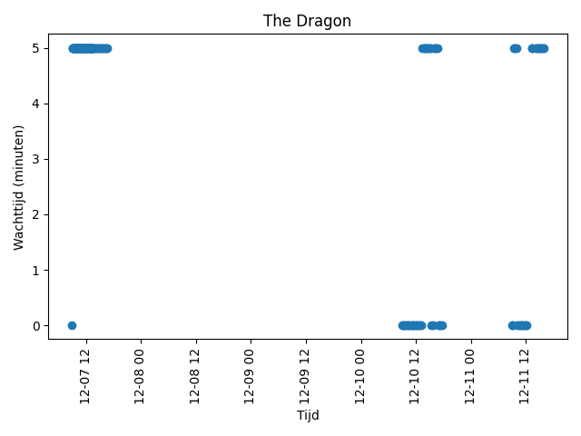
<h3> The Ducks</h3>
Gemiddelde wachttijd: 4,65 minuten  Mediaan wachttijd: 5,0 minuten  Standaard deviatie: 1,27 minuten  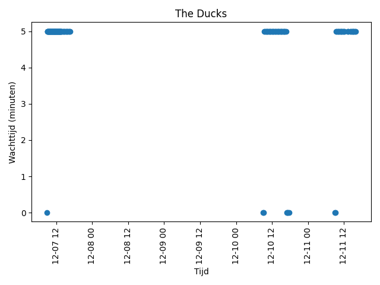
<h3> The Falling Tower</h3>
Gemiddelde wachttijd: 4,5 minuten  Mediaan wachttijd: 5,0 minuten  Standaard deviatie: 1,51 minuten  
<h3> The Fire Brigade</h3>
Gemiddelde wachttijd: 4,23 minuten  Mediaan wachttijd: 5,0 minuten  Standaard deviatie: 1,81 minuten  
<h3> The Flowery Merry-go-Round</h3>
Gemiddelde wachttijd: 3,88 minuten  Mediaan wachttijd: 5,0 minuten  Standaard deviatie: 2,09 minuten  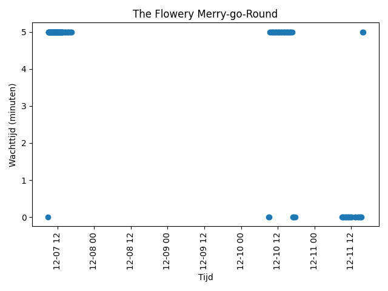
<h3> The Flying Bikes</h3>
Gemiddelde wachttijd: 4,5 minuten  Mediaan wachttijd: 5,0 minuten  Standaard deviatie: 1,51 minuten  
<h3> The Frogs</h3>
Gemiddelde wachttijd: 4,69 minuten  Mediaan wachttijd: 5,0 minuten  Standaard deviatie: 1,21 minuten  
<h3> The Merry-go-Round</h3>
Gemiddelde wachttijd: 4,65 minuten  Mediaan wachttijd: 5,0 minuten  Standaard deviatie: 1,27 minuten  
<h3> The Pedal Boats</h3>
Gemiddelde wachttijd: 1,58 minuten  Mediaan wachttijd: 0,0 minuten  Standaard deviatie: 2,33 minuten  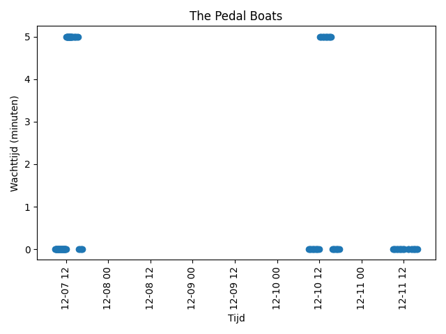
<h3> The Pirate Ship</h3>
Gemiddelde wachttijd: 4,69 minuten  Mediaan wachttijd: 5,0 minuten  Standaard deviatie: 1,21 minuten  
<h3> The Pirates' Playground</h3>
Gemiddelde wachttijd: 0,0 minuten  Mediaan wachttijd: 0,0 minuten  Standaard deviatie: 0,0 minuten  
<h3> The Rabbits</h3>
Gemiddelde wachttijd: 4,5 minuten  Mediaan wachttijd: 5,0 minuten  Standaard deviatie: 1,51 minuten  
<h3> The Raft</h3>
Gemiddelde wachttijd: 0,0 minuten  Mediaan wachttijd: 0,0 minuten  Standaard deviatie: 0,0 minuten  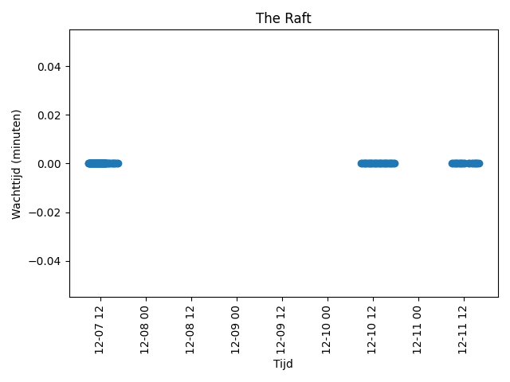
<h3> The Ride to Happiness by Tomorrowland</h3>
Gemiddelde wachttijd: 2,42 minuten  Mediaan wachttijd: 0,0 minuten  Standaard deviatie: 2,51 minuten  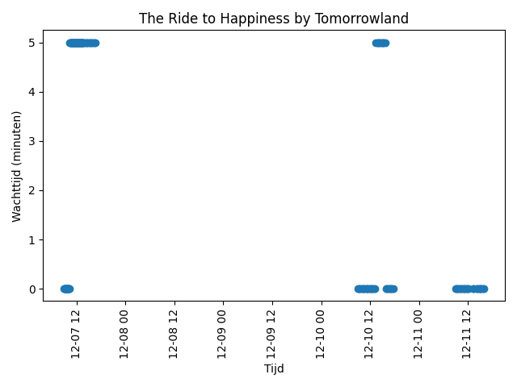
<h3> The Spider's Web</h3>
Gemiddelde wachttijd: 0,0 minuten  Mediaan wachttijd: 0,0 minuten  Standaard deviatie: 0,0 minuten  
<h3> The Suspension Bridge</h3>
Gemiddelde wachttijd: 0,0 minuten  Mediaan wachttijd: 0,0 minuten  Standaard deviatie: 0,0 minuten  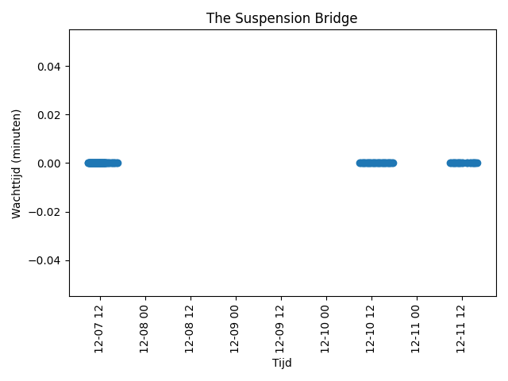
<h3> The Swinging Tree</h3>
Gemiddelde wachttijd: 4,69 minuten  Mediaan wachttijd: 5,0 minuten  Standaard deviatie: 1,21 minuten  
<h3> The Tractors</h3>
Gemiddelde wachttijd: 4,27 minuten  Mediaan wachttijd: 5,0 minuten  Standaard deviatie: 1,77 minuten  
<h3> The Traffic Park</h3>
Gemiddelde wachttijd: 4,65 minuten  Mediaan wachttijd: 5,0 minuten  Standaard deviatie: 1,27 minuten  
<h3> The Water Lilies</h3>
Gemiddelde wachttijd: 4,5 minuten  Mediaan wachttijd: 5,0 minuten  Standaard deviatie: 1,51 minuten  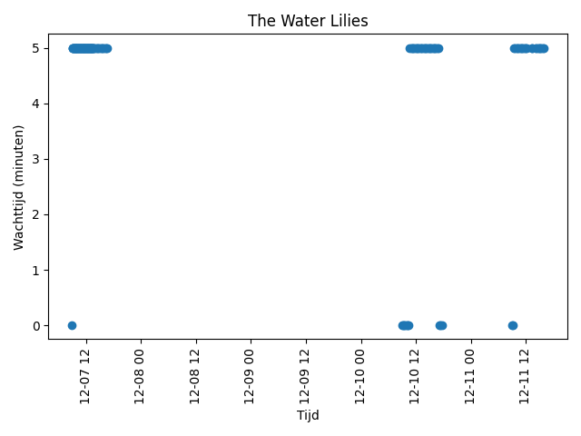
<h3> Wickie The Battle</h3>
Gemiddelde wachttijd: 3,69 minuten  Mediaan wachttijd: 5,0 minuten  Standaard deviatie: 2,21 minuten  
<h3> Wienerwalz</h3>
Gemiddelde wachttijd: 4,5 minuten  Mediaan wachttijd: 5,0 minuten  Standaard deviatie: 1,51 minuten  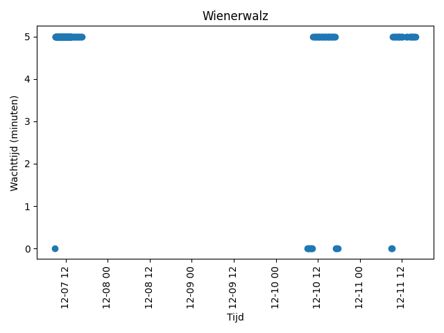
<h3> Willy's Playground</h3>
Gemiddelde wachttijd: 0,0 minuten  Mediaan wachttijd: 0,0 minuten  Standaard deviatie: 0,0 minuten  
